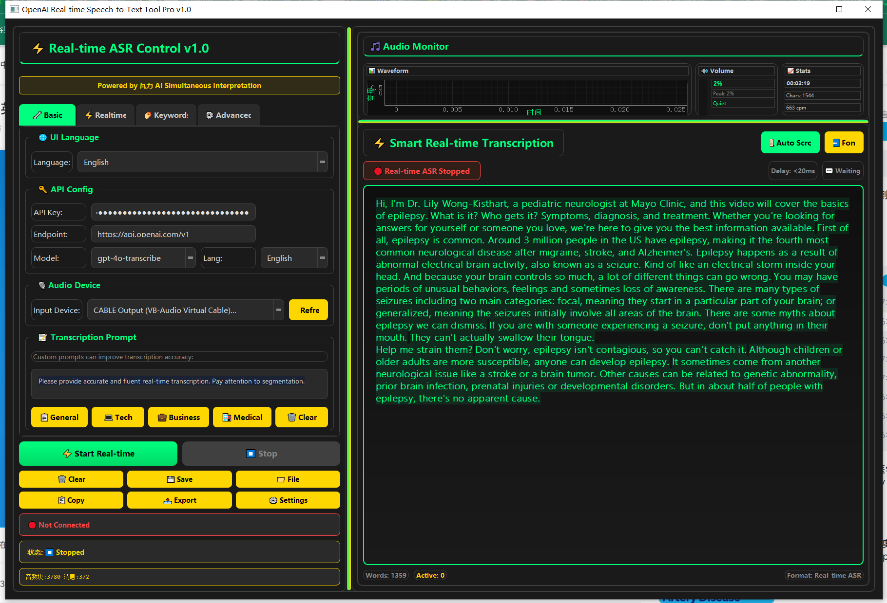

# openai-realtime-transcriber
一个基于OpenAI Realtime API的专业级实时语音转录工具，支持多语言界面、打字机效果显示、音频可视化等高级功能
## ✨ 主要特性

### 🎙️ 实时语音转录
- 基于OpenAI最新Realtime API (gpt-4o-transcribe),支持模型：'gpt-4o-transcribe', 'gpt-4o-mini-transcribe', 'whisper-1'
- 超低延迟 (<20ms) 实时转录
- 支持15+种语言的语音识别
- 智能语音活动检测 (VAD)
- 高质量音频处理和噪音抑制

### 💫 打字机效果显示
- 流畅的打字机式文字显示
- 实时字符流式渲染
- 智能换行和段落分割
- 颜色编码显示状态（黄色流式 → 绿色完成）

### 🎵 音频监控可视化
- 实时波形显示
- 音量级别监控
- 峰值检测和噪音分析
- 会话统计信息

### 🌐 多语言界面
- 中文/English双语界面
- 实时语言切换
- 本地化配置保存

### 🔧 高级配置选项
- VAD敏感度调节
- 音频质量增强
- 网络连接优化
- 性能参数调优

### 📁 文件转录支持
- 支持多种音频格式 (MP3, WAV, M4A, MP4等)
- 大文件满25MB自动分割处理
- 批量处理能力

### 🏷️ 智能热词优化
- 自定义专业术语词典
- 预设行业词汇包 (AI、技术、商务、医疗、教育)
- 提升特定领域识别准确度

## 🚀 快速开始

### 环境要求

- Python 3.8+
- OpenAI API Key
- 音频输入设备（麦克风）

### 安装依赖

```bash
# 克隆项目
git clone https://github.com/70451136/openai-realtime-transcriber.git
cd openai-realtime-transcriber

# 安装依赖
pip install -r requirements.txt
